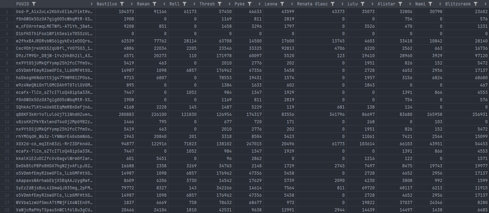

3 a.m. productions present:

# Champion's Picnic Table

## Table of Content
- [Introduction](#introduction)
- [Preconsiderations](#Preconsiderations)
- [Code snippets](#Code-snippets)
- [Acquired Data](#Acquired-Data)
- [Exploratory Data Analysis](#Exploratory-Data-Analysis)
- [Picnic Table Theory](#Picnic-Table-Theory)
- [Champion's Picnic Table](#Champions-Picnic-Table)
- [Evaluation](#Evaluation)
- [Extra: Visualisation](#Extra-Visualisation)

## Introduction

All information are up-to-date as of May 2024. Python 3.11 was used for this project.

Thanks to Riot Games implementation of Vanguard into League, I finally managed to quit the game and spend my time more wisely.
Even though this project still focuses on League of Legends, it's rather on the data science kind of side.

Back in the day I was reading an article from Riot Games about the likelihood of a certain champion being played by players if they also play certain other champions.
Unfortunately, I wasn't able to find the article again (it was called something picnic related, hence the name of this project), which is why I decided to recreate it.

Another thing this project should cover are the different methods of dimensionality reduction and clustering.
I will describe them later.

Organised as I am, I am writing this README while working on it.
Please bear with me if it's missing things.
Also, check out my other [League of Legends related data science project](https://github.com/artoria-dev/data-science-lol) if you are into such things.

Please use this repository as you wish.

Also, for any inquiries, questions, suggestions, chit-chat, threats (hopefully not), or whatnot, feel free to find me one Discord by my tag *letmecook7*.

This project does not aim the be any meaningful at all. I just want to show, how nice that *could* be if done correctly (which I probably didn't do lol).
If any Riot emplyoee stubles across this by any chance, please send me the link to the original article.

## Preconsiderations

The basic idea sounds rather simple:
1. Get PUUIDs of players
2. Squeeze champion mastery data out of Riot's API
3. Do cool stuff with it
4. ???
5. Profit

Let's dive a bit deeper into the details, though.

**To 1:** Lucky as I am, I have had someone providing me with tons of PUUIDs which is why we don't have to worry about gathering them. I will still provide a way to get them, in case you want to recreate that.

Imagine the following pseudo-code:
```
1. Get a single PUUID (either manually or using one of Riots endpoints such as /riot/account/v1/accounts/by-riot-id/{gameName}/{tagLine})
2. Create an empty list to store the PUUIDs
3. Append the PUUID to the list
4. Repeat the following steps until you are satisfied or your PC explodes:
    4a. Take the last PUUID from the list
    4b. Get their match history using the /lol/match/v5/matches/by-puuid/{encryptedPUUID}/ids endpoint
    4c. Pass the match Ids to the /lol/match/v5/matches/{matchId} endpoint to get the participants (which are stored as PUUIDs)
    4d. Append the new PUUIDs to the list
```
Happy coding.

**To 2:** Riot does offer a neat [API](https://developer.riotgames.com/) with loads of endpoints to use.
For this very project, we will be using the `/lol/champion-mastery/v4/champion-masteries/by-puuid/{encryptedPUUID}` endpoint.
It requires an "encrypted PUUID" which is nothing but a normal PUUID with a different name.

    Sidenote:
    PUUID stands for "Player Universally Unique Identifier".
    It's a unique identifier for a player across all regions, obviously.

If we feed it with a PUUID, it will return a list of various champion mastery related data as seen below:

- puuid
- championPointsUntilNextLevel
- chestGranted
- championId
- lastPlayTime
- championLevel
- summonerId
- championPoints
- championPointsSinceLastLevel
- tokensEarned

We really are only interested in the `championId` and `championPoints` attributes.
Since the `championId` is a number, not the actual champion's name, and I doubt anyone knows which champion the id 266 has, we will need to map it to the respective champion name.
I am sure there is an endpoint for it, but I will instead make use of Riot's [Data Dragon](https://developer.riotgames.com/docs/lol#data-dragon) and create my own dictionary.
All there is left then is to save the data.
Probably in a [pandas DataFrame](https://pandas.pydata.org/docs/).

**To 3:** I tend to digress a lot when I got a set of data in front of me which is why there probably will be other/more stuff covered later which are not planned yet.
What is planned, though, is using algorithms or the magic of machine learning to find patterns or relationships between the champions or rather the players interest in them.
I was thinking not to use any libraries for the sake of the machines, but since I would have to optimise a lot I might keep it simple.

**To 4:** I am not too sure what to put here.

**To 5:** I had to, sorry. The joke is older than I.
Shoutouts to JetBrains PyCharm at this point telling me that in formal/written english `than I` is correct, while `than me` is not.

## Code snippets

I will provide a quick rundown of the code I have written to get the data.
Don't worry, I won't show much.
Please see the code in the repository for more details.

First things first.
I won't show you Riot's Data Dragon content since it's quite huge.
You will just have to trust me.
As mentioned before, we are only interested in the champion's name and its id.

```python
import requests

response = requests.get(f"https://ddragon.leagueoflegends.com/cdn/14.9.1/data/en_US/champion.json")
c_data = response.json()
c_dict = {}
for champion in c_data['data']:
    c_dict[c_data['data'][champion]['key']] = c_data['data'][champion]['name']
for key in c_dict:
    print(f'"{key}": "{c_dict[key]}"')
```

This will give us a dictionary with the champion's id as the key and the champion's name as the value or in the words of the output stream:

``` 
"266": "Aatrox"
"103": "Ahri"
"84": "Akali"
...
```

Creativity kicked in at this point and I saved this dictionary as `data_baron.py` to import it in the main script.

Since I got provided with a bit over 20 million PUUIDs, and considering a single request takes around 1.4 seconds, I would have to run the script for ~30 days straight.
I could either reduce the number of PUUIDs iterated or optimise the script..

I ended up doing both. I did reduce the number of PUUIDs to 1 million and optimised the script by using a multiprocessing pool.
The basic idea is to get 10 gremlins (workers) to simultaneously make the API calls.
Now, since the API has limitations of `500 requests every 10 seconds` and `30000 requests every 10 minutes` (which both can be reduced to `50 requests every second`), I had to calculate the delay required (please check your API limitations as it depends on the key you got provided).

`10` gremlins times `0.21` seconds delay equal in `47.62` requests per second, which is slightly below the limit. 
I could even reduce the delay to `0.2` seconds or even `0.19` seconds (considering latency) but I rather go the safer route.

The *safer* route cost me `0.02 times 1 million divided by 10 gremlins = 2 thousand seconds` or roughly 34 minutes, though.

Alright, enough of that. Here is the main method using the multiprocessing pool.

```python
def main():
    global results
    signal.signal(signal.SIGINT, signal_handler)
    puuids = load_puuids()

    processed_count = 0

    with ThreadPoolExecutor(max_workers=MAX_WORKERS) as executor:
        futures = [executor.submit(process_mastery_data, puuid) for puuid in puuids]
        for future in as_completed(futures):
            result = future.result()
            if result:
                results.append(result)
                processed_count += 1
                print(f'{processed_count} / {len(puuids)} ({processed_count / len(puuids) * 100:.2f}%) processed')
                # if processed_count % BATCH_SIZE == 0:
                    # save_dataframe()

    save_dataframe()
    print('all data has been processed and saved')
```

(Beware of saving the data too often as it slows down the process a lot, especially in later stages.)

That provides me some nice output stream.

```
...
2 / 1000000 (0.00%) processed
3 / 1000000 (0.00%) processed  
...
1000000 / 1000000 (100.00%) processed
```

I also decided to use signals to save the progress in case I decide to stop the script (or my PC needing a break).

Not much more interesting to say at that point. More code later!

## Acquired Data

Eventually the script finished and the whole process took about 12 hours.
Not bad. To be fair, I just used about 5 % of the given PUUIDs.
Anywho, using JetBrains DataSpell (why am I not getting paid for that?) I can get a nice view of the data (yes, Excel would have worked too).



Keep in mind, that the sheet contains 168 columns and 1 million rows (I cannot believe Riot already released 167 champions..).
Because of that huge amount of data I will use the [feather](https://arrow.apache.org/docs/python/feather.html) file format from now on, instead of CSV as it's way more efficient ([Source](https://towardsdatascience.com/the-best-format-to-save-pandas-data-414dca023e0d)).

```
<class 'pandas.core.frame.DataFrame'>
RangeIndex: 1000000 entries, 0 to 999999
Columns: 168 entries, PUUID to Briar
dtypes: int64(167), object(1)
memory usage: 1.3+ GB
None
                                                    PUUID  ...  Briar
0       XGcJIifu2MJDNTDOtiEYq3fH-4p4Mk_WeG1ZbUpjCdy10x...  ...      0
1       Usd-P_Aix2uLx2KbXvGIimJYiktHvtuGSjLcacEmlm8e4T...  ...      0
2       SyEzZdBjsBuL41DmaQJ835mg_2pFMWMlPhNQ4UlE_ZFAiY...  ...      0
3       1E_QktXAZYOYnib3s55J45h7K9AjmWdJdmTDZLoM5wdvpF...  ...      0
4       mErSfjT128h3hifwhtsAJY7LVANwCvr_6_2mTWaGcia5W5...  ...    759
...                                                   ...  ...    ...
999995  MHrByI83WIMBI3WztL4F0Kk07Q3qrhqWlkXBKXmz109RHm...  ...   1090
999996  K0JSIyIzO5B3QRa550w_bYz5-zWjW9JAN4Mrocv00D0VIP...  ...   3358
999997  -8eSCzZkk00hCc7ZChUNlD8DhnjR21Rf9mJ6Sb3xxX6fZQ...  ...    116
999998  HBmRG7FNhi4Dr5lrwUeDYt5NX3w8IKrxLGC5X_123taXwO...  ...   3382
999999  eCefwqVQjbQL-9KuWTh_5W0lj2ERptRLVaOR2H0_WUCA6J...  ...   2608

[1000000 rows x 168 columns]
```

Now, since I don't know what else to put in this chapter as the screenshot covers everything, I will dive into the PUUIDs again for a moment.
Since the data is supposed to show relations between champions, or the players interest in them, I had to sort of mix the given PUUIDs.
That is because player in higher elo tend to play less unique champions than players in lower elo.
I did try to find evidence for that, but to be honest, if you are reading this, you probably got at least some idea of the game and that should be common sense (I know I am lazy).
By scrambling the PUUIDs, I hope to get a more diverse dataset with player from various elos and amount of champions played frequently.

    Sidenote:
    The word "elo" refers to the Elo rating system which is used for calculating the relative skill levels of players.
    Higher Elo means higher skill level. It's a bit more complex than that, but that's the gist of it.

And no, I won't be sophisticating the philosophy or existence of true randomness here.
There are libraries for that (not the one with books, though).

## Exploratory Data Analysis

This might have become my most favourite part of such projects.
We managed to grab loads of data and stored them nicely.
Now it's time to see what the data can tell us.
I will be using [matplotlib](https://matplotlib.org/) to plot the graphs.
Keep in mind that all visuals and results from now on are based on the data we have acquired and may vary from the actual overall data.

First and foremost, the easiest thing is probably to plot the most and least played champions.


For the 5 most played champions there is not much else to say that these are quite popular champions.
On the other hand, the 5 least played champions may be because of their release date. Let's take a look at them.

| Champion       | Popularity % | Popularity Rank | Release Date |
|----------------|--------------|-----------------|--------------|
| *Most played*  |              |                 |              |
| Ezreal         | 11.0         | 18              | 2010-03-16   |
| Lee Sin        | 16.2         | 2               | 2011-04-01   |
| Yasuo          | 11.7         | 14              | 2013-12-13   |
| Thresh         | 13.4         | 8               | 2013-01-23   |
| Lucian         | 12.5         | 11              | 2013-08-22   |
| *Least played* |              |                 |              |
| Nilah          | 2.3          | 157             | 2022-07-13   |
| Rammus         | 3.1          | 144             | 2011-06-22   |
| Skarner        | 9.0          | 28              | 2023-07-19   |
| Smolder        | 7.5          | 42              | 2024-01-31   |
| Briar          | 4.5          | 93              | 2023-09-14   |

(Popularity data taken from [League of Graphs](https://www.leagueofgraphs.com/champions/builds/euw), Release Date data taken from [League of Legends Wiki](https://leagueoflegends.fandom.com/wiki).)
Please keep in mind, that the data is up-to-date as of May 2024. The popularity is based on the following criteria:
- All champions
- All roles
- Platinum+ elo
- Region: EU West
- Normal and ranked games

I chose platinum+ elo because it's a good indicator for the overall player base as of the [rank distribution](https://www.leagueofgraphs.com/rankings/rank-distribution/euw).

First, I am happy that my data represents the overall data provided from League of Graphs quite well.
One indicator for the popularity may be the release date of the champions as most of the least played champions are quite new.
Two interesting champions are Rammus and Skarner, though. Even though Rammus is about 13 years old, he doesn't seem to be attractive to the player base.
Skarner, on the other hand, has just received a VGU (Visual and Gameplay Update) in [Patch 14.7](https://www.leagueoflegends.com/en-us/news/game-updates/patch-14-7-notes/), not too long ago, which may be why he has got a high popularity but not many mastery points accumulated yet.

Apart from that, we could also take a look at the most one-tricked champions.

    Sidenote:
    One-tricking refers to playing a single champion almost exclusively.

Now, in order to identify a one-trick I put the criteria to have at least 70 % of the total mastery points on a single champion.


To be fair, I wasn't expecting to see Pantheon or Warwick on the list, but I guess that is simply because we used a little dataset.
Using different criteria or more data would probably yield different results.

Last but least, I present a rather goofy graph, but hey.. we are exploring the data after all.
For this I grouped the most played champions by the first letter of their PUUID (only taking the first 10 letters into account).


Whenever you wonder what champion to mainly play next, just check your PUUID and if you happen to see it starting with an "E", you are more likely to choose Ekko.

## Picnic Table Theory

If you happen to know what [Word Embeddings](https://neptune.ai/blog/word-embeddings-guide) are, you probably know where this is going.

Imagine the following set of data:

|     | X | Y |
|-----|---|---|
| v_1 | 1 | 2 |
| v_2 | 5 | 7 |

We could represent this as a vector in a 2-dimensional space so that `v_1 = (1, 2)` and `v_2 = (5, 7)`.
Plotting this is simply as it just requires a 2-dimensional space.
Adding another dimension would require a 3-dimensional space, though.
Now, as the poor 3-dimensional beings we are, we can hardly imagine a 4-dimensional space.
What about a 5-dimensional space? You get the idea.

As you saw before, we acquired a dataset in the format of

`PUUID | Champion 1 | Champion 2 | ... | Champion N` with the dimensions `[1000000 rows x 168 columns]`.

Can you imagine a 167-dimensional space? Well, I can't.
This is why we sort of have to reduce the dimensions in order to visualise the data.
In order to do that, I picked three different methods of dimensionality reduction:
- [t-SNE](#t-SNE) (t-Distributed Stochastic Neighbor Embedding)
- [PCA](#PCA) (Principal Component Analysis)
- [AE](#AE) (Autoencoder)

Don't worry. I won't dig too deep into their functionality. Yet, I want to provide a basic understanding of what they do.

### t-SNE

t-SNE is specifically designed to model complex polynomial relationships in the data.
It excels at preserving local neighborhood structures, making it great for identifying clusters of closely related data points.
It considers the probability distribution over pairs of high-dimensional objects in such a way that similar objects have a high probability of being picked while dissimilar points have an extremely low probability of being picked.

It does so by following these three steps:
1. Compute pairwise similarities between data points in the high-dimensional space using the gaussian distribution.
2. Compute pairwise similarities between data points in the low-dimensional space using the t-distribution.
3. Minimise the difference between the two similarity matrices kullback-leibler divergence.

Please take a look at the [source](https://www.jmlr.org/papers/volume9/vandermaaten08a/vandermaaten08a.pdf) if you are more interested in the details.

### PCA

PCA is a linear technique that focuses on preserving the variance of the dataset.
It reduces dimensions by projecting them onto the axes with the highest variance, ignoring the possible nonlinear relationships.
PCA does not focus on maintaining local neighbor relationships but rather on capturing the directions of maximum variance in data, which can sometimes lead to overlapping clusters if the data separation is primarily non-linear.

It does so by following these steps:
1. Standardise the data.
2. Calculate the covariance matrix.
3. Calculate the eigenvectors and eigenvalues of the covariance matrix.
4. Sort the eigenvectors by decreasing eigenvalues and choose the top k eigenvectors.
5. Recast the data into the new subspace.

Once again.. You know the deal. [Source](https://www.jmlr.org/papers/volume9/vandermaaten08a/vandermaaten08a.pdf), if you are more interested in the details.

### AE

Autoencoders are neural networks trained to learn an efficient compressed representation (encoding) of the input data, then reconstruct the output (decoding) from this representation.
The method focuses on minimising the reconstruction error, which can lead to preserving different types of structure compared to methods that focus on preserving neighborhood continuity.
As a deep learning technique, autoencoders can model complex, non-linear relationships that neither PCA nor t-SNE might capture directly.
The specific architecture and training of the network can lead to various unique representations.

[Source](https://arxiv.org/pdf/1707.08475).

Keep in mind, dealing with neural networks offer a lot of flexibility and possibilities.
Results may differ depending on the architecture, hyperparameters, and training process.

Before we dive into the results, I want to put a little disclaimer on why the results may differ from each other.

Each algorithm has a different mathematical focus — some preserve global structures, while others preserve local neighborhoods.
The settings (like perplexity in t-SNE or number of epochs in training Autoencoders) significantly affect the outcomes.
Also, algorithms like PCA are sensitive to scale, whereas t-SNE is sensitive to local structure which can lead to different representations based on how the data is scaled or normalised.
Lastly, the inherent structures in the data (clusters, manifolds, linear separability) can be differently emphasised by each method.

## Champion's Picnic Table

In order to visualise, I thought about adding some colour to it.
The idea is to colour the nodes based on the champion's primary class or role.

    Side note:
    "Role" refers to the position a champion is played in the game (Toplane, Jungle, Midlane, Adc, Support).
    "Class" refers to the type of champion (Fighter, Mage, Assasin, Tank, Marksman, Support).

To be honest, these classes are rather misleading which is why I will be using the roles for the colouring (e.g. Ivern counting as *Support* even though, they are being played in the jungle, not on the support position).
Both dictionaries can be found in the GitHub repository if you wish to use a different colouring.
Classes were taken from Riot's [Data Dragon](https://ddragon.leagueoflegends.com/cdn/14.9.1/data/en_US/champion.json), while roles were taken from [League of Graphs](https://www.leagueofgraphs.com/champions/builds).

Alright, let's take a look at the results.

### t-SNE


```python
def tsne():
    t = time.time()
    tsne = TSNE(n_components=2, random_state=random_state)
    embeddings_2d = tsne.fit_transform(data_normalised)
    visualise(embeddings_2d, "t-SNE", t)
```

### PCA


```python
def pca():
    t = time.time()
    pca = PCA(n_components=2)
    embeddings_2d = pca.fit_transform(data_normalised)
    visualise(embeddings_2d, "PCA", t)
```

### AE


```python
def autoencoder():
    t = time.time()
    model = Sequential()
    model.add(Dense(128, activation='relu', input_shape=(data_normalised.shape[1],)))
    model.add(Dense(64, activation='relu'))
    model.add(Dense(2, activation='relu')) # encoder layer
    model.add(Dense(64, activation='relu'))
    model.add(Dense(128, activation='relu'))
    model.add(Dense(data_normalised.shape[1], activation='sigmoid'))
    model.compile(optimizer='adam', loss='mean_squared_error')
    model.fit(data_normalised, data_normalised, epochs=500, batch_size=4096, verbose=1)
    encoder = Sequential(model.layers[:3])
    embeddings_2d = encoder.predict(data_normalised)
    visualise(embeddings_2d, "Autoencoders", t)
```

## Evaluation

Ok! Three different approaches, three different results.

Sadly, there is no way to tell which one is the most accurate representation as there is no goal, target, or similar to optimise for.
There are only two ways to compare the results: **duration** (which is rather useless) and **personal accuracy** (which is subjective).
 
Anyhow, let's take a look at the duration.

|             | Duration in seconds | Duration in minutes |
|-------------|---------------------|---------------------|
| t-SNE       | 7065.63             | 117.77              |
| PCA         | 9.39                | 0.16                |
| Autoencoder | 1207.78             | 20.13               |

PCA seems to be speedrunning dimensional-space-reduction in Any% while t-SNE runs on MSDOS.

Keep in mind, that all the variants shown are dependent on the hyperparameters used and the data provided(!)
I did try to implement UMAP as well, but it took way too long to compute, even after tweaking parameters, and I had to cancel it.

For my personal, subjective accuracy, here are my most played champions:

- Qiyana
- Riven
- Camille

Now.. Yea, it took me a moment, but eventually I found and highlighted them.


Distance-wise, t-SNE seems to be the most accurate representation, but that may be because of the peculiar distribution of the nodes on the landscape.
Running t-SNE with a lower amount of data yields a less structured output, though.
Interestingly, if we take a look into the one-trick champions identified earlier, we could assume to find them all in the outer regions.
That is not the case for all the champions, though. `Panteon, Quinn and Shaco` can be found outside, while `Nidalee and Warwick` are rather located in the center close to the other champions.

PCA and Autoencoder seem to be more similar to each other and are *sort of* equal in terms of accuracy of my personal champions.

Sadly, my knowledge about such algorithms is rather limited and can be compared to the player's interest in Rammus.
If you happen to be smarter than me, please let me know what you think about the results.
If you believe a different approach would yield better results, or if you have recommendations for the hyperparameters, feel free to leave a message.

## Extra: Visualisation

Now, since the 2-dimensional plots are nice, but not really *nice*, I thought about adding a bit more to it.

First, a 2-dimensional map in the browser using JavaScript and the [D3.js](https://d3js.org/) library.
I did quickly run into memory issues alongside [CORS](https://developer.mozilla.org/en-US/docs/Web/HTTP/CORS) problems, though.

I did decide to use the [Plotly](https://plotly.com/) library for Python to create an interactive 3-dimensional plot.
In order to do so, we need to reduce the dimensions to 3 instead of 2. I decided to use PCA for that as it has the lowest computation time.

```python
def pca_3d():
    pca = PCA(n_components=3)  # increase n_components to 3
    embeddings_3d = pca.fit_transform(data_normalised)
    return embeddings_3d
```

There was also a different visualisation method required.

```python
def visualise_3d(embeddings, method_name):
    fig = go.Figure()
    for i, champion in enumerate(champion_names):
        role = champ_role.get(champion, "Unknown")
        color = role_colors.get(role, "gray")

        fig.add_trace(go.Scatter3d(
            x=[embeddings[i, 0]],
            y=[embeddings[i, 1]],
            z=[embeddings[i, 2]],
            mode='markers',
            marker=dict(
                size=5,
                color=color,
                opacity=0.8
            ),
            text=champion,
            name=champion,
            hoverinfo='text'
        ))
    fig.update_layout(
        title=f'{method_name} Visualisation',
        scene=dict(
            xaxis=dict(title=''),
            yaxis=dict(title=''),
            zaxis=dict(title=''),
        )
    )
    fig.show()
```

It works the same way as the 2-dimensional visualisation, except that we are using a 3-dimensional plot instead and added some extra features like the champion's name on hover.

That results in the following, interactive plot (ignore the white space below. I didn't know how to nicely crop my browser lol).


It surely needs a bit more love to be perfect, but I will leave that to you.

Thank you for reading. Here is a potato.


```
